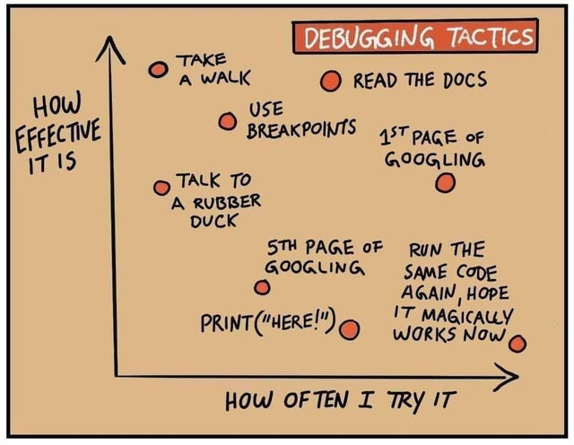

# Exam project

This document describes the exam project for the course "Information Science" for the UAntwerp Master of Linguistics (from 2021-2022 onwards: "Master of Digital Text Analysis").

## Task

**Use the DBpedia lookup API to build a public access catalogue for the Great Books.**

This task contains (at least) the following components:

- Build a Jupyter Notebook that accepts user input of a book title, such as "Moby Dick", "To Kill a Mockingbird", "The Origin of Species", ...

- Make a call to the [DBpedia lookup API](https://github.com/dbpedia/lookup) (prefix `https://lookup.dbpedia.org/api/search/PrefixSearch?QueryString=`). (Don't be surprised if the API sometimes returns incomplete information, it is not the most recent lookup API. The most recent one uses SPARQL queries though).

- The API response, see e.g. `https://lookup.dbpedia.org/api/search/PrefixSearch?QueryString=mockingbird`, will be XML which refers to the ontology of each result. For books look for `http://dbpedia.org/ontology/Book`

- Parse the XML response and extract the result you need. If there are several, allow the user to pick a choice before you continue to the resource itself, e.g. `http://dbpedia.org/resource/To_Kill_a_Mockingbird`

- The resource itself can be rendered in different formats, but JSON is the easiest to work with, e.g. `http://dbpedia.org/data/To_Kill_a_Mockingbird.json` (notice the structural differences in the URL!). Parse this JSON and extract the metadata you need.

- This RDF-JSON of the resource contains a lot of metadata about the book, but also its author. As this is Linked Data, many metadata elements again refer to other DBpedia resources, e.g. `http://dbpedia.org/resource/Harper_Lee`, which you can use to further enrich your result.

- Return the relevant results to the Jupyter Notebook environment and display them nicely.

## Requirements

### Pass or fail

The following is required to pass the exam:

- Upload **functional** code to your GitHub repository. If the Notebook doesn't work when I try to run its code, I will try to debug your code, but of course, this drastically reduces your chances to pass this course. I would rather have functional code that does one thing, than code that tries to do ten things but doesn't run.

- Put the code in a new repository, outside of `Information Science`. Push your last update by **Wednesday 20 January 00:00 hours**.

- Add a short ``README.md`` that describes your application, any necessary dependencies (third-party libraries, ...), etcetera. However, please take care to use only the Python standard library and/or the third-party libraries we used in the course itself. This will greatly reduce the chances of your code breaking because of dependency issues.

- Organize your code by using at least two different modules (e.g. `project.ipynb`, importing something like `dbpedia.py`).

- As with any exam, this project is a **personal assignment**. Please do not collaborate with your fellow students (and take care not to publish your code prematurely). I will be able to tell if two codebases are essentially the same.

### Extra credit

The following will give you extra credit:

- The more relevant metadata you can include in your result, the better. Take full advantage of the 'linked' in the DBpedia Linked Data, for instance, by including some information about the author.

- Including code comments such as function docstrings will make your code a lot more readable and easier to follow.

- Displaying the result in the notebook can be done in different ways. Jupyter Notebook offers some nice options here, for instance displaying HTML which can dramatically improve the layout of your results. Proper visual presentation of search results is a vital component of information quality, but there is a limit. After that, layout is only eye-candy, so do not invest too much time in this.

### Maxing out

The following will make your project exceptional:

- If you follow the Linked Data path, you will find even more metadata than title or author. You should by no means feel obliged to stick to just the DBpedia environment. Maybe the other Wikimedia projects have something to offer too (Wikidata, Wikimedia Commons). Perhaps there is even the possibilty to return some images with the result?

- Your own creativity is more than welcome!

## Tips

- **Start with the basics**: read book input from notebook, make the API call, print the result. Only then try to make that better by adding metadata or improving the layout.

- **Test your application with many examples**, e.g. "The Hobbit", "The Origin of Species", "War and Peace", "Alice in Wonderland", etc. Also test it with invalid input: empty strings, characters that are unsafe for URLs, integers, etcetera.

- **Avoid local operations** so the code only runs in Jupyter Notebook. By the way, this will make for a nice online portfolio project!

- **Refactor** every self-contained unit of code to a function or class. Think of your project as a long line of pipes. If you can't see the bigger picture, work from the bottom up: one function at a time. E.g.: a function that takes user input string (e.g. "Moby Dick") and returns a DBPedia API URL, or: a function that takes a resource URL and turns that into the matching JSON URL (see above).

## Consultation

If you have questions regarding the project architecture, design or implementation (not about actual code problems), you can contact me the following weeks to make an appointment for a short consultation during the week of **11 to 15 January**. However, this is 100% optional.